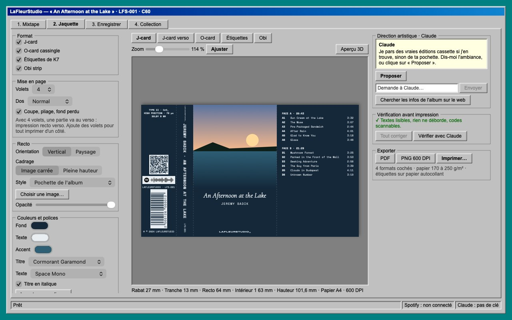
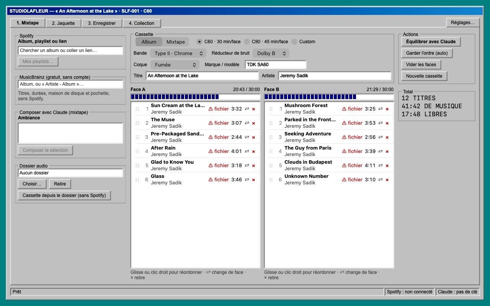
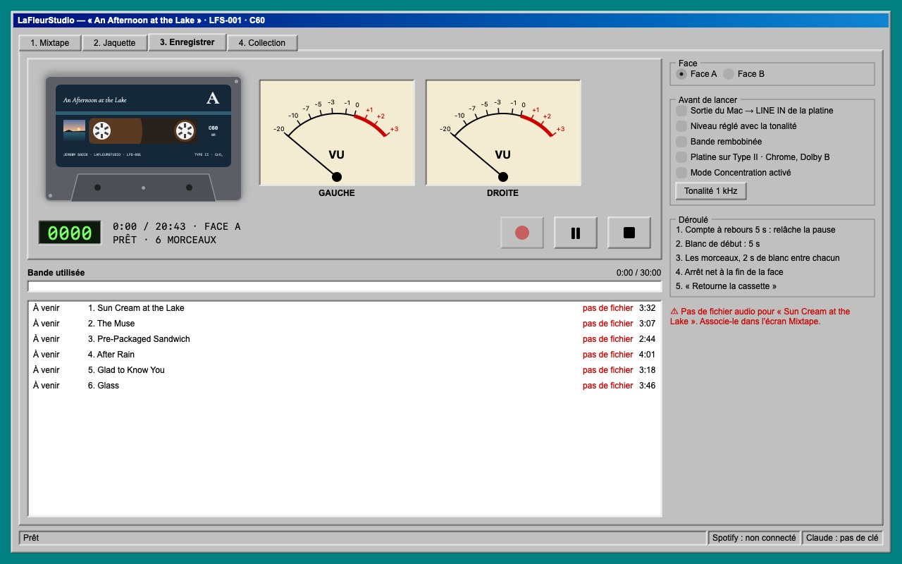
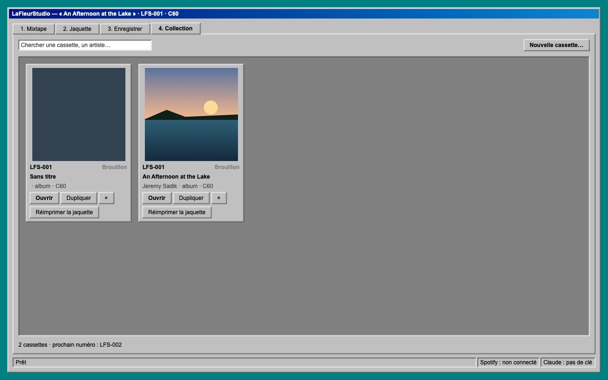

<p align="center">
  
</p>

<h1 align="center">
  <picture>
    <source media="(prefers-color-scheme: dark)" srcset="docs/images/logo-clair.svg">
    
  </picture>
</h1>

<p align="center">
  <b>Fabrique de vraies cassettes audio, de A à Z, sur ton Mac.</b><br>
  Tu prépares les faces, Claude dessine la jaquette, tu imprimes, et l'app enregistre la K7 pile au bon moment.
</p>

<h3 align="center">
  <a href="https://github.com/Jonlekern/kassette-Studio/releases/latest/download/STUDIOLAFLEUR.zip">⬇️ Télécharger STUDIOLAFLEUR pour Mac</a>
</h3>
<p align="center"><a href="README.md">🇬🇧 English version</a></p>
<p align="center">macOS 14 Sonoma ou plus récent · Mac Apple Silicon ou Intel · toujours la dernière version</p>

<p align="center">
  
</p>

---

## Installer (2 minutes)

1. **Télécharge** [STUDIOLAFLEUR.zip](https://github.com/Jonlekern/kassette-Studio/releases/latest/download/STUDIOLAFLEUR.zip).
2. **Double-clique** sur le zip, puis glisse **STUDIOLAFLEUR.app** dans le dossier **Applications**.
3. **Premier lancement** : l'app n'est pas signée par Apple, donc macOS la bloque la première fois.
   - Ouvre l'app une fois. macOS affiche un message : clique **OK**.
   - Va dans **Réglages Système → Confidentialité et sécurité**, descends tout en bas et clique
     **Ouvrir quand même**.
   - Si ça ne marche toujours pas, colle ceci dans le Terminal :
     ```bash
     xattr -dr com.apple.quarantine /Applications/STUDIOLAFLEUR.app
     ```

C'est tout. Les fois suivantes, elle s'ouvre normalement. Tu avais l'ancienne app **LaFleurStudio** ? Supprime-la des Applications : tes cassettes et tes réglages sont gardés. Pour mettre à jour : retélécharge et remplace
l'app, tes cassettes et tes réglages sont gardés.

## Ce qu'il te faut

| | | |
|---|---|---|
| ✅ | **Une clé API d'IA** | **Claude** (recommandé), ou **GPT** (OpenAI) ou **Gemini** (Google), au choix dans Réglages → IA. Ce n'est **pas** un abonnement Claude Pro / ChatGPT Plus : c'est un compte à part, payé à l'usage ([Claude](https://platform.claude.com), [OpenAI](https://platform.openai.com/api-keys), [Gemini](https://aistudio.google.com/apikey)). Le bouton **i** de l'app explique tout. |
| ✅ | **Tes fichiers audio** | Un dossier avec tes morceaux (MP3, FLAC, WAV, AIFF, M4A). |
| ✅ | **Une platine K7 + un câble** | Sortie casque ou carte son USB du Mac → entrée LINE IN de la platine. |
| ✅ | **Une imprimante** | Papier 170 à 250 g/m² pour les jaquettes, papier autocollant pour les étiquettes. |
| ➖ | **Spotify Premium** | Facultatif. Sans lui : recherche MusicBrainz, ou « Cassette depuis le dossier ». |
| ➖ | **Jeton Discogs** | Facultatif. Donne les crédits et les photos des vraies éditions cassette. |

Le pas à pas complet (clés, Spotify, premier démarrage) : [app/LISEZMOI.md](app/LISEZMOI.md).

## Ce que fait l'app

### 1. Mixtape : préparer les faces

Cherche un album (Spotify ou MusicBrainz) ou pars de ton dossier. L'app répartit les morceaux sur les faces
A et B selon ta cassette (C60, C90…) et relie chaque morceau à son fichier. Pour une mixtape, tu décris
l'ambiance et Claude propose.



### 2. Jaquette : Claude directeur artistique

- **Formats** : J-card de 3 à 8 volets, O-card cassingle, étiquettes de K7, obi.
- **Claude** va chercher les **vraies éditions cassette** de l'album et s'en inspire. Si l'album n'est
  jamais sorti en K7, il part du **dos du CD ou du vinyle**. Il connaît le plan exact d'une cassette,
  tiré de l'étude de 27 vraies K7 ([docs/etude-cassettes.md](docs/etude-cassettes.md)).
- **Tu lui parles** : « plus sombre », « mets le logo Sony », « mets la vraie pochette ». Il peut tout changer.
- **Codes qui se scannent** : code-barres EAN-13 / UPC-A / Code 128, QR code, code Spotify.
- **Vérification avant impression** : textes qui débordent, trop petits, contraste, codes illisibles.
- **Export** : PDF avec fond perdu et traits de coupe, PNG 600 DPI, ou impression directe
  **calibrée à la règle** pour ton imprimante.


<p>
  
  
</p>

### 3. Enregistrer : la platine

Une platine façon Windows 98 avec VU-mètres. Elle joue la face depuis tes fichiers, avec le compte à
rebours, les blancs entre les morceaux, et s'arrête net à la fin de la face.



La cassette porte ton étiquette, et tu choisis la couleur de la coque :


### 4. Collection

Toutes tes cassettes, à rouvrir ou à dupliquer.



---

L'app parle français, anglais, russe et allemand (Réglages → Langue).

## Pour les curieux

- [app/LISEZMOI.md](app/LISEZMOI.md) : mode d'emploi complet, et comment compiler soi-même avec Xcode.
- [docs/etude-cassettes.md](docs/etude-cassettes.md) : comment sont faites les vraies K7 (étude de 27 cassettes).
- [docs/brainstorm.md](docs/brainstorm.md) : les décisions prises pendant la conception.
- [docs/analyse-texs.md](docs/analyse-texs.md) : analyse de Tapercraft (vhs.texs.org), l'outil de référence.
- [maquettes/](maquettes/) et [prototype-v0/](prototype-v0/) : les maquettes et le tout premier prototype.
- À chaque envoi de code, GitHub compile l'app, lance les tests, photographie chaque écran et publie la
  nouvelle version dans [Releases](https://github.com/Jonlekern/kassette-Studio/releases/latest).

## Licence

Code libre sous [licence MIT](LICENSE) : tu peux le réutiliser, le modifier et le partager, **à condition de
créditer STUDIOLAFLEUR** (garder la mention de copyright). Le nom, le logo et l'icône STUDIOLAFLEUR ne sont
pas libres. Les polices gardent leur propre licence.
