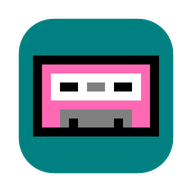
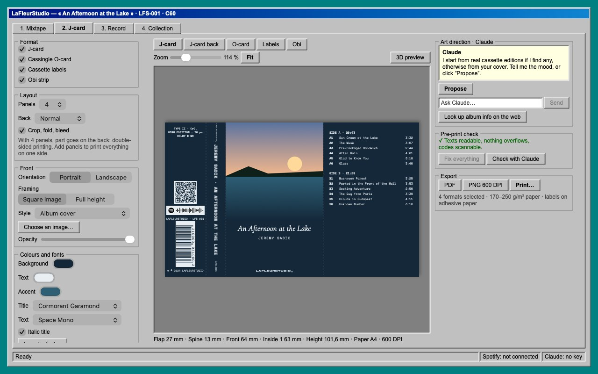
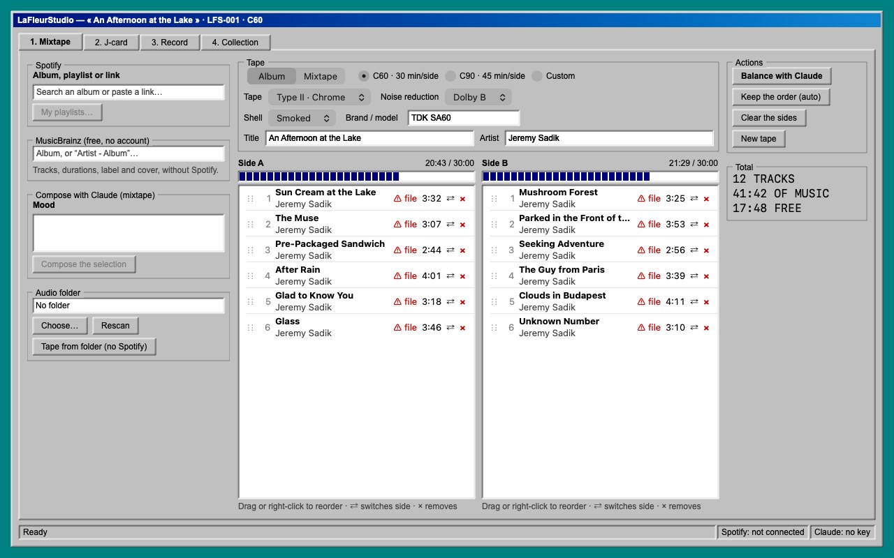
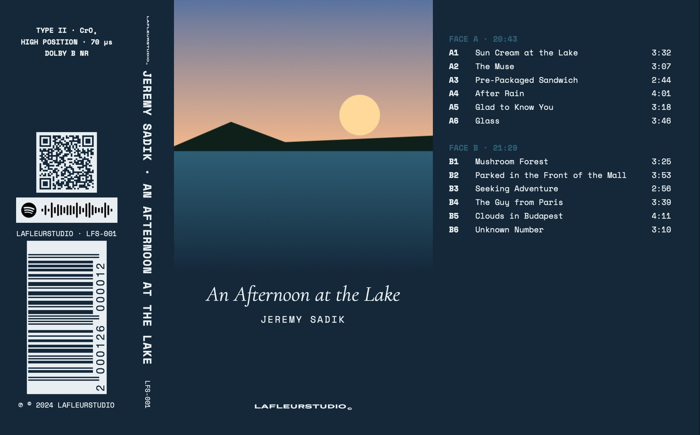
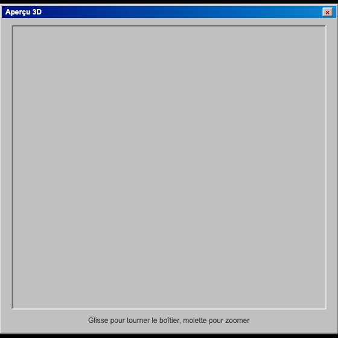
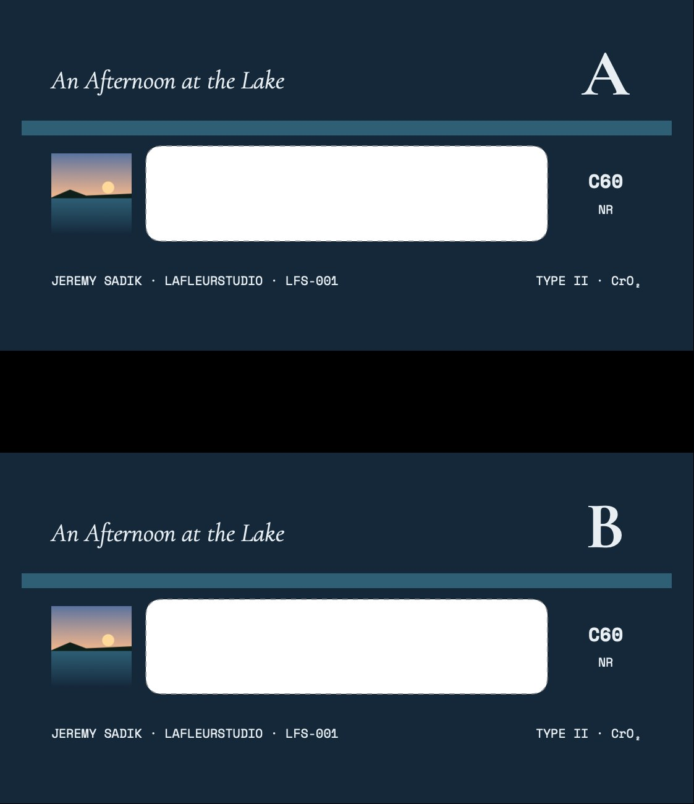
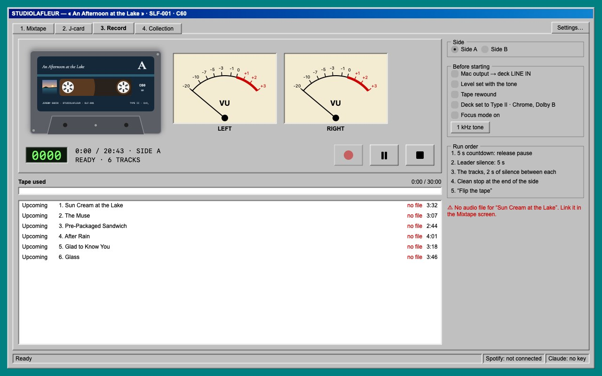
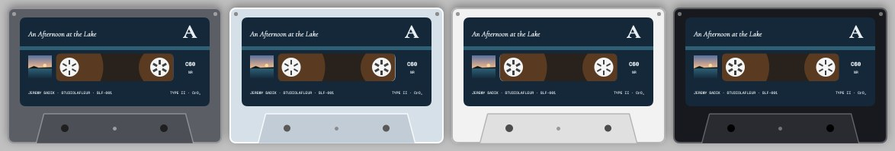
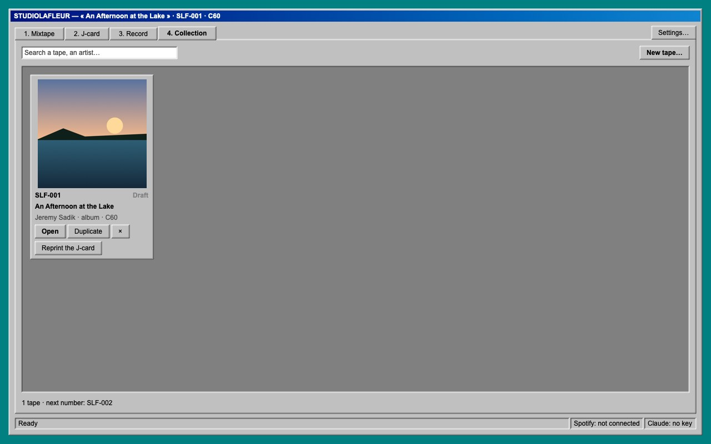

<p align="center">
  
</p>

<h1 align="center">
  <picture>
    <source media="(prefers-color-scheme: dark)" srcset="docs/images/logo-clair.svg">
    
  </picture>
</h1>

<p align="center">
  <b>Make real audio cassettes, start to finish, on your Mac.</b><br>
  You plan the sides, an AI art director designs the J-card, you print it, and the app records the tape right on time.
</p>

<h3 align="center">
  <a href="https://github.com/Jonlekern/kassette-Studio/releases/latest/download/STUDIOLAFLEUR.zip">⬇️ Download STUDIOLAFLEUR for Mac</a>
</h3>
<p align="center"><a href="README.fr.md">🇫🇷 Version française</a></p>
<p align="center">macOS 14 Sonoma or later · Apple Silicon or Intel · always the latest version</p>

<p align="center">
  
</p>

---

## Install (2 minutes)

1. **Download** [STUDIOLAFLEUR.zip](https://github.com/Jonlekern/kassette-Studio/releases/latest/download/STUDIOLAFLEUR.zip).
2. **Double-click** the zip, then drag **STUDIOLAFLEUR.app** into your **Applications** folder.
3. **First launch**: the app isn't signed by Apple, so macOS blocks it the first time.
   - Open the app once. macOS shows a warning: click **OK**.
   - Go to **System Settings → Privacy & Security**, scroll to the bottom and click **Open Anyway**.
   - If it still won't open, paste this into Terminal:
     ```bash
     xattr -dr com.apple.quarantine /Applications/STUDIOLAFLEUR.app
     ```

That's it. After that it opens normally. Coming from the old **LaFleurStudio** app? Delete it from Applications: your cassettes and settings are kept. To update, download it again and replace the app: your
cassettes and settings are kept.

The app speaks English, French, Russian and German (Settings → Language).

## What you need

| | | |
|---|---|---|
| ✅ | **An AI API key** | **Claude** (recommended), **GPT** (OpenAI) or **Gemini** (Google), chosen in Settings → AI. This is **not** a Claude Pro / ChatGPT Plus subscription: it's a separate pay-as-you-go account ([Claude](https://platform.claude.com), [OpenAI](https://platform.openai.com/api-keys), [Gemini](https://aistudio.google.com/apikey)). The **i** button in the app explains everything. |
| ✅ | **Your audio files** | A folder with your tracks (MP3, FLAC, WAV, AIFF, M4A). |
| ✅ | **A cassette deck + a cable** | Mac headphone output or USB sound card → the deck's LINE IN. |
| ✅ | **A printer** | 170–250 g/m² paper for J-cards, sticker paper for the labels. |
| ➖ | **Spotify Premium** | Optional. Without it: MusicBrainz search, or “Cassette from folder”. |
| ➖ | **Discogs token** | Optional. Adds credits and photos of real cassette editions. |

## What the app does

### 1. Mixtape: plan the sides

Search for an album (Spotify or MusicBrainz) or start from your folder. The app splits the tracks across
sides A and B to fit your tape (C60, C90…) and links each track to its file. For a mixtape, describe a mood
and the AI suggests tracks.



### 2. J-card: an AI art director

- **Formats**: 3- to 8-panel J-cards, cassingle O-cards, cassette labels, obi strips.
- The AI looks up **real cassette editions** of the album and takes inspiration from them. If the album was
  never released on tape, it starts from the **back of the CD or vinyl**. It knows the exact layout of a
  cassette, based on a study of 27 real tapes.
- **Talk to it**: “darker”, “add the Sony logo”, “use the real cover”. It can change anything.
- **Codes that scan**: EAN-13 / UPC-A / Code 128 barcodes, QR codes, Spotify codes.
- **Pre-print check**: text that overflows, text too small, low contrast, unreadable codes.
- **Export**: PDF with bleed and crop marks, 600 DPI PNG, or direct printing **calibrated with a ruler**
  for your printer.



<p>
  
  
</p>

### 3. Record: the deck

A Windows 98-style deck with VU meters. It plays the side from your files, with a countdown, gaps between
tracks, and a clean stop at the end of the side. The cassette shows your label, and you pick the shell colour.





### 4. Collection

All your cassettes, to reopen or duplicate.



---

Every push to GitHub builds the app, runs the tests, takes a screenshot of every screen and publishes the
new version in [Releases](https://github.com/Jonlekern/kassette-Studio/releases/latest). Full manual
(French): [app/LISEZMOI.md](app/LISEZMOI.md).

## License

Free and open source under the [MIT License](LICENSE): reuse, modify and share it, **as long as you credit
STUDIOLAFLEUR** (keep the copyright notice). The STUDIOLAFLEUR name, logo and icon are not covered. Fonts
keep their own licenses.
